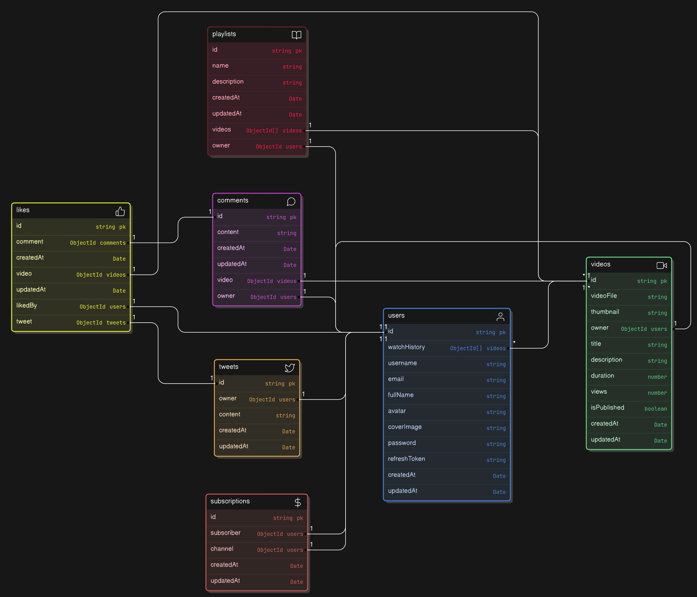

# VidTweet Schema



---

# VidTweet - Backend System  
A backend system combining features of **YouTube** and **Twitter** to support video-based tweets with social interaction functionalities.

---

## Project Concept  
VidTweet provides a platform where users can share video-based tweets and engage through comments, likes, and interactions.

---

## Features  

### 1. User Authentication  
- Secure **JWT-based login** and **email verification** for user access.  

### 2. Content Management  
- Handles **video uploads**, tweets, and **file attachments** efficiently.  
- Supports **comments**, **likes**, and user interactions on tweets and videos.  

### 3. Database Management  
- Uses **MongoDB** to store:
  - User profiles  
  - Videos  
  - Tweets  
  - Comments  
  - Likes  

### 4. API Development  
- Provides **RESTful APIs** for:
  - CRUD operations on tweets  
  - Managing videos  
  - Handling user interactions  

### 5. Like & Comment Features  
- Manages **likes** and **comments** to enhance user engagement with tweets and videos.  

### 6. File Handling  
- Supports uploading and processing of:
  - **Images**  
  - **Videos**  
  - Other media files  

### 7. Security & Error Handling  
- Ensures:
  - **Input validation** and secure endpoints  
  - Comprehensive **error handling** for smooth operation  

---

## Technology Stack  
- **Node.js**  
- **Express.js**  
- **MongoDB**  
- **Cloudinary**

---

## How to Run  
1. Clone the repository:  
   ```bash
   git clone https://github.com/Zaheer872004/VidTweet.git
   cd VidTweet
   npm i 


2. And then setup .env file with this content with require value
    ```bash
    #Mongodb Setup

    MONGODB_URI=mongodb+srv:// username:password@cluster0.wfwpisi.mongodb.net


    PORT=3000

    CORS_ORIGIN=*


    # AUTH STUFF
    SALT_ROUNDS=

    ACCESS_TOKEN_SECRET=
    ACCESS_TOKEN_EXPIRY=

    REFRESH_TOKEN_SECRET=
    REFRESH_TOKEN_EXPIRY=


    CLOUDINARY_CLOUD_NAME=
    CLOUDINARY_API_KEY=
    CLOUDINARY_SECRET_KEY=

    # API environment variable	
    # if have
    # CLOUDINARY_URL=


    # Resend api key
    RESEND_API_KEY=

3. Run the Project
    ```bash
    npm run dev  # if you're using npm if not use other like yarn pnpm etc
    
